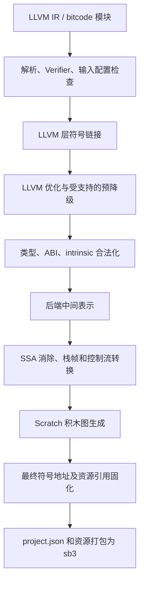

# s·C·ratch++：LLVM IR → Scratch 编译器设计

版本：0.1  
日期：2026-09-13  
状态：实现设计稿；记录已确定需求、建议架构及分阶段验收要求，不代表相应功能已经实现。

实施后的实际功能与构建方式见 [README.md](README.md)，已执行的验证见 [docs/TEST_RESULTS.md](docs/TEST_RESULTS.md)。本文中的阶段规划继续保留，不能将其整体视为已经实现。

阅读导航：第 1—5 节为范围和总体架构，第 6—12 节为内存、数值与执行核心，第 13—18 节为汇编及其他 IR 机制，第 19—23 节为支持计划和工程接口，第 24—28 节为验证、基准、里程碑及参考资料。

## 1. 文档约定与目标

本项目将 LLVM IR 编译为原版 Scratch 3 可执行的 `.sb3` 项目，主要运行环境为 TurboWarp。编译结果使用官方积木和官方画笔扩展，不依赖 JavaScript 扩展、TurboWarp 专用积木或修改后的 VM。

长期目标是扩大现有高级语言代码的可移植范围，并探索后端自身及完整工具链的自举。该目标不等于已经支持所有 LLVM 特性，也不等于已经验证完整 Clang 在 Scratch 的资源限制内可运行。

本文中的状态含义：

- **已确定**：来自需求讨论的最终决定，实现必须遵守。
- **设计规则**：为落实决定而提出的架构与接口约束；修改时需同步更新依赖模块和测试。
- **建议默认值**：尚未通过原型确认的实现选择，不作为用户已确认的要求。
- **分阶段支持**：有明确实现路径，但只有完成验收后才能出现在编译器的“已支持”清单中。
- **延后**：不阻塞基础版本，不允许通过无声忽略伪装成已支持。

本文主要描述 LLVM IR 和 Scratch 后端。普通函数库、特定语言异常匹配、操作系统接口不在核心后端中按函数名称硬编码实现；它们通过普通 LLVM 模块或显式目标接口接入。

## 2. 已确定的需求与废弃方案

### 2.1 最终需求

| 编号 | 决定 |
| --- | --- |
| D01 | 兼容原版 Scratch 3，主要针对 TurboWarp 优化。 |
| D02 | 恢复正常 LLVM 类型、位宽、转换和指令语义；不再抹除数值类型。 |
| D03 | 用一个列表作为程序虚拟内存；每项是一个 `0…255` 的字节，静态区、堆和栈均位于其中。 |
| D04 | 地址与内存列表下标对应；空指针编码保留为 `0`，不能把地址作为列表中的特殊文本索引。 |
| D05 | 精确数值运算采用逐字节实现；字节内可精确使用原生算术时直接计算，否则使用常量表等实现。 |
| D06 | 支持普通整数位运算与移位；不要求将其逆向改写为普通算术。 |
| D07 | 字符串在程序内存中按输入对象表示存为字节，不改用 Scratch 字符串代替程序字符串。 |
| D08 | 所有生成的函数、调用器和运行时辅助自定义积木均设置“不刷新屏幕”。 |
| D09 | 仅生成一个绿旗启动脚本；初始化后调用 `main`。暂不实现事件模块。 |
| D10 | 单执行角色，无克隆；图形输出使用画笔。SB3 格式所需的舞台不算第二个执行角色。 |
| D11 | 当前不实现并发调度；异步执行体系将来另行接入。 |
| D12 | 函数指针在最终 LLVM 模块与存活函数集合确定后统一编码，间接调用使用 `if/else` 二分分派。 |
| D13 | 函数指针位于低地址保留区，程序数据从其后开始；指针编码需要满足对齐等语义要求。 |
| D14 | 允许控制流结构化时使用辅助状态和复制代码。 |
| D15 | Scratch 积木作为内联汇编；使用官方 opcode，不加额外 `scratch:` 前缀。 |
| D16 | 所有代码进入 LLVM IR 后链接；不实现多个 `project.json` 之间的代码链接。 |
| D17 | x86、ARM 等机器内联汇编直接报错；空汇编加 memory clobber 的编译器屏障允许使用。 |
| D18 | 输入来源不限；具体 LLVM 版本、ABI、指令、属性和目标相关语义必须落在已声明支持范围内。 |
| D19 | 编译器宿主跨平台，使用 Clang；标准库、ABI库、链接器和LLVM库独立准备，不依赖 Visual Studio/Windows SDK。 |
| D20 | 目标 C++ 标准库先采用禁用异常的 libc++ 配置；底层运行库编译成 LLVM bitcode 统一链接。第一批提供分配、基础 C 函数、生命周期及终止式错误处理。 |
| D21 | 后续标准输入使用询问，标准输出使用独立 Console 列表；数学函数也可由 LLVM 运行库实现。这些接口不属于第一批实现。 |
| D22 | 虚拟文件系统延后，可使用 Rust `no_std + alloc` 的 `BTreeMap` 实现，通过 C ABI 接入标准库；不要求宿主文件访问。 |
| D23 | 已支持的基本操作降为按操作、位宽、布局共享的槽位运行时；不新增 opcode 解释器。常量、视图、phi 计划在编译期处理，源目标重叠及临时存储生命周期必须明确。详见共享槽位运行时文档。 |
| D24 | 首版源码调试使用真实 LLDB、IR 远程目标与 TW 解释器桥接；关闭 TW 编译，不依赖 Debugger 插件，不固定 TW 版本。源码/IR/积木映射采用独立 sidecar，不插入调试积木。符号镜像仅用于 LLDB 读取，不执行其中的机器码。首版支持动态断点、源码单步、调用栈和基本变量，容器美化与写变量延后。详见 debugger/README.md。 |

“正常 LLVM 语义”不要求为每个内存字节附带动态类型标签。类型和结构约束主要由解析器、LLVM Verifier 及后端支持检查在编译期验证；运行时运算必须实现对应指令要求。

### 2.2 明确废弃的早期方案

- 所有数值统一成 Scratch 万能值、忽略位宽及整数溢出。
- 一标量一列表项的紧凑内存，以及预留字节间距但只在首项存完整标量的表示。
- 独立 Scratch 静态库目标格式和 `project.json` 代码重定位链接器。
- 拒绝普通位运算、依赖禁止 LLVM 优化来避免位运算。
- 要求任意 CFG 都恢复成没有辅助变量、没有代码复制的自然嵌套结构。

已有 Scratch 库若要参与链接，需要先转换为包含 Scratch 汇编的 LLVM 函数。原 SB3 可以作为转换工具的输入，但不是核心链接器的输入。

## 3. 编译流程



各阶段的职责：

1. **输入检查**：识别 LLVM 版本、目标布局、调用约定、模块标志、内联汇编与扩展需求。
2. **链接**：使用 LLVM 链接能力选择定义、解析别名及处理模块级规则。缺失的必需运行时实现作为普通未解析符号报告；未解析 `extern_weak` 按其规则解析为空值，不与普通外部符号混同。
3. **优化与预降级**：保留正常 LLVM 数值语义。选择与后端匹配的 pass，而非直接套用某宿主机器的完整代码生成流水线。
4. **合法化**：将支持但不直接发射的指令转换为已定义的字节操作、内存操作、调用或控制转移。
5. **后端生成**：构造与 JSON 无关的值、语句、基本块和积木表示。
6. **最终固化**：所有可能生成可寻址函数或基本块的变换结束后，分配代码地址与数据地址，解析符号引用。
7. **打包**：序列化积木图、资源和启动脚本，进行结构检查并输出 SB3。

实际实现可以调整内部阶段顺序，但必须保持以下不变量：

- 地址固化前所有引用仍是符号引用，不能以普通数字充当临时地址。
- 后续变换若新增可寻址符号，必须重新执行地址布局，不能局部偷偷插入地址。
- 经 Scratch 汇编、资源元数据或外部接口引用的符号，必须在死代码消除前声明为存活入口。
- 不在 LLVM 的标准目标代码生成前把 LLVM 整数规则换成 Scratch 浮点数规则。
- 不能让标准优化再次改写已经形成的、具有 Scratch 执行约定的低层片段。

## 4. 输入兼容性与目标配置

### 4.1 接收范围

输入支持文本 `.ll` 和 LLVM bitcode `.bc`。一轮构建只接受能够归一到同一已支持目标配置的模块。配置至少包含：

- LLVM IR/bitcode 主版本和解析兼容范围。
- `DataLayout`、端序、指针表示宽度、GEP 索引宽度、对象对齐规则。
- 调用约定与变参 ABI。
- 汇编接口版本、后端 ABI 版本和所需 intrinsic 集合。
- 当前执行配置：单执行上下文、允许的官方扩展、内存容量。

缺失布局时，不根据文件来自哪个目录或编译器运行在哪台机器上猜测。可通过构建配置明确提供布局；其使用必须进入构建记录。

当前地址配置不支持 `null_pointer_is_valid`：在实现地址零可访问的专门映射前，不能忽略该属性并继续生成代码。函数 `prefix`、`prologue` 等特殊地址表示也按第 6.2 节的能力边界检查。

不同模块的目标三元组不必仅按字符串相等判断，但也不能只因标量宽度相同就认为 ABI 兼容。真正的兼容性检查由目标配置模块负责。

### 4.2 初始适配建议

设计开始时，机器上的 `C:/Program Files/LLVM/bin/clang.exe` 版本为 22.1.8，仓库是 C++17 的最小程序。首个实现现已使用匹配的 LLVM 22.1 C API。后续版本与目标 ABI 逐个适配，以实际实现支持报告为准。

宿主工具链已调整为 Clang/libc++/LLD/Ninja；Windows 与 Linux 的独立依赖准备和实际验证见 [跨平台构建说明](docs/BUILDING.md)。上述设计时机器路径不再作为默认发现逻辑。宿主可执行文件平台与输入 IR/guest 运行时 ABI 分开配置。

输入来源不限与支持全部目标特性是不同范围。含机器汇编、未知语义 operand bundle、未实现 intrinsic 或不兼容布局时必须给出具体诊断。

## 5. 后端中间表示与实现边界

不直接从字符串匹配 LLVM 文本生成 JSON。解析、验证和类型布局优先复用 LLVM API。

建议设置两层后端表示：

### 5.1 Typed Lowered IR

保留足够的 LLVM 类型与语义信息，显式表示：

- 标量位模式、聚合值分量、固定向量通道。
- 字节内存访问及对齐、volatile、atomic 属性。
- 符号地址、代码地址、数据地址和常量表达式。
- 调用的参数区域、结果区域、复制规则与调用结果种类。
- 基本块、边上并行复制、异常边和其他恢复点。
- Scratch 汇编输入、输出及效果。

### 5.2 Scratch Block IR

与 SB3 ID 解耦，显式区分：

- 命令积木、reporter、布尔输入、子脚本。
- 常量字段、符号字段、动态输入。
- 纯表达式、读取状态、修改状态、可能让出执行、终止或转移控制的操作。
- 自定义积木的参数及局部执行约定。

序列化器负责生成真正的 block ID、变量和列表 ID、参数 ID、`parent/next/inputs` 引用及 mutation。积木图不是表达式 DAG：需要复用的计算结果通过显式临时值保存，不能给同一积木对象安排多个父节点。

## 6. 地址空间、内存与分配

### 6.1 程序内存

程序可寻址内存仅使用一个列表 `M`。实际名称和 ID 由后端命名空间生成。每个有效项目均为整数 `0…255`。

```text
地址 0：空指针，不对应有效列表项目

M 的低地址部分：代码地址保留区及必要的对齐空洞
其后：静态数据区
其后：堆区，向高地址增长
高地址部分：栈区，向低地址增长
```

列表下标就是程序地址。不能通过删除或插入列表中间项目来回收内存；这会移动后续对象的地址。分配器只管理范围，底层列表容量通过末尾增长或启动时预分配获得。

允许额外的编译器内部常量查表列表、测试结果列表等；它们不是第二套程序虚拟内存。普通 LLVM 指针不能自动寻址这些列表。Scratch 汇编显式操作的资源也必须通过约定的符号接口区分。

### 6.2 代码地址

程序可见的函数指针是满足目标要求的整数位模式，而不只是未经处理的密集序号。

- `0` 保留为空指针。
- 所有最终保留、可由 LLVM 引用的函数分配代码地址，包括链接进来的运行时 LLVM 函数。
- 纯代码生成器内部的辅助积木不自动成为 LLVM 函数；显式导出后才加入地址集合。
- 函数编码满足目标及函数自身对齐要求；编码允许有空洞。
- 别名引用相应实体或其常量地址表达式。含偏移的 aliasee 按完整表达式求值，不能一律替换成基础实体的起始地址。地址具有可观察身份的不同实体不得自行合并。
- 需要 `blockaddress` 时，将函数指针区推广为代码地址区，为可取地址基本块分配入口标识。其特殊使用限制仍按 LLVM 处理。
- 数据区从最大代码地址之后开始，再对每个数据对象分别对齐。

二分调用器按实际代码地址生成，不要求编码连续。函数调用与基本块跳转使用不同的合法目标集合。

当前代码编码配置不支持函数 `prefix`/`prologue`，遇到时诊断。`prefix` 的内容可能通过函数地址的负偏移读取，不能把相应范围静默填零；若将来支持，需要在代码地址区真实布置该数据并重新设计范围分配。`prologue` 涉及目标机器代码表示，也不能当成普通 Scratch 数据直接忽略。

不能仅靠静态类型区分重合的函数/数据地址：opaque `ptr`、指针比较、`ptrtoint` 和内存传递使这一区分不足以维护一般输入的行为。统一、不重合的表示避免引入额外的动态指针标签体系。

### 6.3 数据布局

以下计算统一由布局服务提供：

- 类型位宽、store size、allocation size、ABI alignment。
- 普通结构体、packed 结构体、尾填充、数组步长。
- 固定向量的位打包和存储布局。
- 指针宽度与各地址空间的索引宽度。

字节数、分配跨度和对齐不能混为一谈。内部寄存器表示可以使用统一的低字节优先形式；实际 load/store 必须按输入端序编码。

未对齐但在输入规则下合法的访问必须正常处理。`GEP` 只计算地址，不立即解引用；不能在指针计算阶段一律将越界或 one-past 地址变为立即终止。

指针的整数转换先在完整位宽上执行。只有访问已分配内存时才能把已确认可表示的地址转换为 Scratch 数值下标；不能先丢弃高位再访问，否则大指针可能错误别名到低地址对象。

### 6.4 堆、栈和容量

静态数据在启动时初始化。堆管理建议先提供对齐分配、释放和空闲块复用，再增加重分配等普通运行时接口；这些接口可实现为 LLVM 模块，不由普通函数名称触发隐式语义。

分配必须检测容量不足及堆栈相遇，不能让 Scratch 无效列表写入被静默忽略。具体失败接口属于运行时 ABI，调试配置应报告请求大小和执行位置。

原版 Scratch 的列表添加实现有 200000 项限制。由于地址直接对应下标，代码地址保留区和对齐空洞也消耗 `M` 的项目预算。常量表在独立列表中分别受列表限制约束。

**建议默认值**：先采用固定容量并在启动时预分配；容量具体值由配置和静态数据规模决定。更大容量的 TurboWarp 配置必须单独声明和测试，不作为原版执行容量保证。

## 7. 整数、布尔和位运算

### 7.1 整数表示

`iN` 的计算表示为 `ceil(N/8)` 个字节。最高字节只有 `N mod 8` 位有效时必须正确屏蔽；符号位是第 `N-1` 位，不一定是某个字节的最高位。

设计覆盖任意固定 `iN`，包括非字节整倍数位宽；首批高强度测试覆盖 `i1/i8/i16/i32/i64` 及若干奇数位宽。实际实现若尚未覆盖某类位宽必须诊断，不得自动当成 `i32`。

有符号/无符号是指令的解释规则。内部可保存统一位模式，不为每个值维护独立的 signed 标签。

### 7.2 运算

- 加减：逐字节进位/借位，保留目标位宽结果。
- 乘法：竖式分列并及时归一化进位；普通乘法只需保留规定低位，溢出 intrinsic 额外计算所需信息。
- 除法、余数：采用精确的多字节算法。带符号操作明确处理商向零截断、余数符号和最小负数边界。
- 比较：按有效高位到低位比较；有符号比较先处理符号。
- 扩展/截断：按位宽和符号规则操作，不能作为无条件 no-op。

每步使用 Scratch 原生运算的中间值必须有精确范围证明。基数为 256 不意味着可以把任意多列乘积一次累加进一个 Scratch 数值。

### 7.3 布尔

`i1` 的程序表示规范化为 `0/1`。列表读取结果可以直接连接到 Scratch 条件输入。布尔 and/or/not 采用原生逻辑；xor 可用已规范化布尔值的等价实现。

布尔求值不能新增或删去带副作用操作。`sext i1 true` 与 `zext i1 true` 结果不同，仍需走整数转换规则。

### 7.4 位运算和查表

`and/or/xor` 按字节处理。**建议默认实现**为每种二元操作一张 `256×256` 常量表，按 `a*256+b+1` 读取；表内容为字节，启动前或编译期生成。

是否采用完整字节表或拆成半字节小表属于可基准比较的实现参数，不改变程序语义。不得未经测量改成巨大的控制分支树。

移位拆成整字节搬移与剩余位移动，处理跨字节拼接和符号填充；不同移位位数使用固定小表或精确字节运算。普通移位、funnel shift、rotate 的位移量规则分别实现。

不要求将位运算重新改成普通算术。LLVM 产生的规范形式由这一数值层直接支持。

## 8. 浮点与位重解释

内存中保存输入类型对应的浮点位模式。`bitcast` 保留位模式，不能经十进制字符串或 Scratch 普通数值转换来回处理。

首个完整标量配置以 `float` 和 `double` 为目标；其他 LLVM 浮点格式按支持矩阵逐项加入。未实现的格式不得悄悄降到 double。

浮点层需要处理：

- 符号、指数、尾数、规格化及次正规数。
- 每条指令要求的舍入，而非仅在写回内存时舍入。
- 正负零、无穷、NaN，以及各比较谓词。
- 整数与浮点转换的范围和舍入语义。
- FMA 的一次舍入；`frem` 不能简单套用会发生额外舍入的除乘减链。
- min/max 系列 intrinsic 对 NaN、零符号的不同约定。

逐字节软件实现作为精确路径。原生浮点快路径只能在证明符合该操作语义后启用。Scratch 数值输入会进行自身的强制转换，因此不得让原始 NaN 等状态无保护地流入普通算术链。

普通浮点指令与 constrained FP 分开支持。动态舍入模式、浮点异常状态和特殊格式属于额外能力，不因完成普通 float/double 就宣称完成。

## 9. 全局数据、符号与初始化

全局初始化采用两遍布局：

1. 分配最终存活的代码实体和数据实体，记录大小、对齐、地址及别名关系。
2. 求值并写入初始化内容，包括嵌套聚合常量、常量 GEP、指针转换、函数引用和对象相互引用。

LLVM Linker 负责定义选择和模块合并；后端消费选择后的模块。不能按“最后读到的同名定义覆盖前一个”模拟 `weak/linkonce_odr/comdat`。

未解析的 `extern_weak` 按 LLVM 规则得到空指针；普通必需外部定义缺失才报链接错误。别名记录完整的 aliasee 常量表达式，包括允许的偏移和转换，初始化时与其他重定位一起求值。

启动时写入全局初值、重置堆栈状态并执行保留的 `llvm.global_ctors`。正常结束时按规定安排 `llvm.global_dtors`。同优先级未规定的次序可以选择稳定次序，但不能把该选择宣传为 LLVM 保证。

`llvm.used`、`llvm.compiler.used`、汇编符号操作数和资源根按各自约定处理。纯资源字节不能因为表现为 LLVM 常量而自动占用 `M`。

普通必需外部函数、TLS 初始化辅助函数等需要真实定义或声明过的目标接口；弱外部引用按上一条处理。后端不通过名字猜测其行为。

## 10. 调用 ABI 与执行状态

### 10.1 统一内部接口

设计上统一表示：

```text
CallRequest:
    目标函数符号或代码地址
    实参值及显式参数区域
    调用者提供的结果区域
    普通返回恢复点
    特殊调用属性及可选异常恢复信息
```

直接调用发射已知自定义积木入口。间接调用发射二分调用器，在叶子调用对应入口。参数数量和聚合结果布局由调用描述决定，不依赖 Scratch 自定义积木原生返回值。

函数入口与间接调用包装必须使用同一 ABI。不能在直接调用中省略必要复制，却在间接调用中按另一套规则处理。

### 10.2 栈帧

栈帧逻辑上包含：

- 帧标识、父帧信息和固定区域范围。
- 参数、结果目标、需要跨调用存活的值。
- 动态分配状态、参数构造区域和栈保存点。
- 程序恢复位置，以及启用相应功能时的异常/非局部转移信息。

Scratch 角色变量不是递归局部变量。可用作短期寄存器，但在调用、重入或恢复点前必须按生存期保存。帧基址可通过自定义积木参数传入，避免依赖会被嵌套调用覆盖的单一临时基址。

### 10.3 复杂参数

| 机制 | 后端规则 |
| --- | --- |
| `sret` | 保持调用者提供结果区域的关系和约束。 |
| `byval` | 创建规定的私有参数副本。 |
| `byref` | 按引用语义处理，不自动做 byval 复制。 |
| `inalloca` | 保留预构造参数区域、栈次序和回收协议。 |
| `preallocated` | 处理 setup/arg/teardown、token 与 operand bundle。 |
| `signext/zeroext` | 按选定 ABI 做必要的参数或结果扩展。 |
| 特殊 calling convention | 通过适配器归一；无法保留语义时诊断。 |

### 10.4 变参

调用点的实参数量和 LLVM 类型是已知的，但被调用端的 `va_list` 可能具有目标相关的可观察内存布局。支持模块需共同实现 `va_start/va_arg/va_copy/va_end`。

若输入已将取参操作降成普通字段访问，后端应构造相符的参数保存区和偏移状态，不能只替换 intrinsic 为简单的连续游标。不同 ABI 分别验收。

## 11. 栈恢复、尾调用与特殊转移

### 11.1 动态 alloca 和 stackrestore

循环或条件内部的 `alloca` 不能无条件提升为函数入口的单一槽。只有证明对象身份和生命周期不受影响时才可优化。

`stacksave/stackrestore` 管理动态分配状态，不得回收之后仍可观察的 SSA spill、结果区域或恢复元数据。建议让固定帧存储与可恢复的动态区使用不同分配记录。

### 11.2 musttail

普通 `tail` 是提示；`musttail` 具有正确性要求。必须同时避免虚拟栈和 Scratch 实际调用层级在尾递归环上无界增长。

- 自尾调用转成循环。
- 相互尾调用通过循环驱动的转移入口实现。
- 回收当前帧前保存必要实参，处理参数区重叠。
- 继承原结果目标和返回恢复点。
- `inalloca/preallocated` 等原地转交规则必须保留。

### 11.3 统一恢复协议

设计建议区分以下转移结果：普通返回、尾转移、异常传播、非局部恢复。它们不必让每个普通调用都支付完整解释器开销，但必须能由执行层可靠表示。

采用原生 Scratch 调用链的快路径时，特殊转移需要逐层传播退出，或进入可显式调度的执行路径。单纯修改 `SP/FP` 不会自动退出 Scratch 调用链。

## 12. CFG、SSA 与结构化

### 12.1 基础构造

为普通函数 CFG 提供保证正确、线性构造规模的后备实现：

1. 给基本块连续编号，保留 `0` 表示退出。
2. 将 `phi` 转换成对应边上的并行复制，必要时拆分边并引入临时值。
3. 为连续编号直接构造平衡的 `if/else` 树，无需排序。
4. 叶子内联该基本块的实际代码；终结指令更新下一块编号或退出状态。
5. 外层使用 while 语义，在 SB3 中发射官方“重复执行直到”积木及合适条件。

```text
pc = entry
while pc != 0:
    if pc <= split:
        ...互斥分支树...
    else:
        ...互斥分支树...
```

以指令、CFG 边、phi 输入和 switch 分支等完整输入规模计，基础结构构造时间和结构规模为线性；数值运算展开及大常量处理成本另计。每次基本块分派约需 `O(log B)` 次比较。

这不是逐条解释 LLVM 指令：基本块内部已经生成真实 Scratch 运算。

### 12.2 常见结构优化

普通区域尽量直接发射顺序、if/else 和循环。允许辅助变量和代码复制，但设置复制预算，避免代码体积膨胀。高级结构恢复不自动继承基础构造的线性保证，需独立分析。

一个后备分派迭代只能进入一个叶子。禁止使用会因叶子更新 `pc` 而在同一轮意外继续命中其他块的平行独立 if 链。

### 12.3 值的求值位置

`load` 和带状态的汇编输出必须在定义位置产生并保存，不能在使用处重新读取。纯表达式只有在操作数稳定、没有跨越内存或效果边界时才允许嵌套或重算。

代码复制后重建 SSA/值映射和前驱边信息。复制可取地址基本块时保留规范入口，不把某个上下文特化副本随意当作原始间接目标。

### 12.4 间接跳转与 callbr

`indirectbr` 通过代码地址到本函数合法目标集合的映射处理。基本块地址遵守 LLVM 的特殊规则，不擅自扩大其可比较或可解引用范围。

`callbr` 的汇编出口必须对应 LLVM 已声明的后继；输出值和 phi 按所选 LLVM 版本的规则处理。模板字符串不允许隐藏未声明的外部控制转移。

## 13. Scratch 内联汇编

### 13.1 名称与基本原则

汇编指令名称使用官方 opcode，例如 `operator_add`、`data_itemoflist`、`pen_penDown`。不使用本地化显示文字作为唯一机器标识，不加额外命名空间前缀。

LLVM 内联汇编字符串由本后端解释，输入、输出和 clobber 则使用明确版本化的约束规则。Scratch opcode 并不自动成为 Clang 内置支持的汇编语言；高级语言到该 IR 的包装和约束适配属于前端接入工作。

最小示意：

```llvm
call void asm sideeffect "pen_penDown", ""()
call void asm sideeffect "", "~{memory}"()
```

以上分别表示一个官方画笔操作和一个编译器内存屏障。复杂模板的文本语法尚需原型确认；本文固定其语义要求，不把以下候选语法当成已实现接口。

### 13.2 模板能力

模板必须能够表示：

- 命令序列、reporter 输出、布尔结果。
- 嵌套 reporter 输入以及控制积木的子脚本。
- `$0` 等输入/输出操作数引用。
- 静态字段、菜单选项、变量/列表符号和资源符号。
- 输出位置与多输出聚合值。
- 允许时的显式控制出口。

**候选文本形式**：opcode 加命名输入/字段及花括号子脚本；操作数位置引用 LLVM 约束，不包含固定 SB3 ID。实际语法须经 parser、round-trip 与诊断样例验证后固定。

首个汇编配置只接受明确实现的约束子集。不能因为某个约束在宿主 x86 上合法就认为 Scratch 后端也支持；不支持的固定寄存器、早期覆盖、间接内存操作数等需要单独诊断或实现。

### 13.3 效果约定

| 效果 | 处理要求 |
| --- | --- |
| 纯 reporter | 可以按数据依赖优化，但不能擅自改变输出表示。 |
| 读取计时、随机或其他状态 | 声明状态依赖，保持规定的求值次数和位置。 |
| 画笔、变量、列表等修改 | 声明副作用，不能作为无用纯表达式删除。 |
| 读取/修改虚拟内存 | 使用正确的操作数及 memory clobber/效果描述，约束跨越该点的内存变换。 |
| 可能等待或让出执行 | 显式标记，供调用和状态保存规则使用。 |
| 终止或改变控制流 | 使用声明过的控制接口，不作为普通顺序命令隐藏。 |

副作用标记不是任意内存访问声明的替代品；memory clobber 也不自动表示线程同步 fence。

空汇编加 memory clobber 在生成时可以不产生任何执行积木，但不能在仍可能重排内存操作的阶段过早丢失其约束。

### 13.4 范围与合法性

- 拒绝 x86、ARM 等机器汇编，不尝试按未知 Scratch opcode 继续执行。
- 不允许在汇编中创建事件帽子。自定义积木定义由函数生成器负责，原型等内部对象不作为随意插入的普通命令。
- 当前单角色、无克隆、无事件模块的限制仍生效；相应非帽子积木也不能绕过配置限制。
- 只允许配置内的官方扩展；画笔为基础图形输出扩展。
- 编译器保留变量和列表使用隔离命名空间。访问内部状态必须通过声明的接口，不能依赖猜测生成名称。
- 需要可寻址字符串时使用程序字节内存；Scratch 文本输入输出通过明确的编码适配操作连接，不能假装 LLVM 有可直接传递的动态字符串标量。

### 13.5 资源与链接可见性

资源以 LLVM 元数据及专用常量描述，并带有显式根引用或等效保留约定。后端提取资源到 SB3，不把纯资源内容放入程序内存。

资源和函数符号不能只藏在模板字符串中。引用需通过可追踪的操作数或元数据表达，避免链接和优化误删。

资源记录至少包含逻辑符号、类型、内容或构建输入引用，以及对应积木字段。打包阶段生成内容校验标识、合并重复内容并重写相关引用。资源封装仍是 SB3 打包工作，不是第二个代码链接器。

## 14. 内存 intrinsic 与其他常用 intrinsic

intrinsic 由语义注册表按 LLVM intrinsic ID/签名识别，不以模糊名字匹配。每个条目描述支持的类型、效果、降级方法和必要测试。

### 14.1 内存操作

- `memcpy`：对合法输入复制规定字节，维护访问属性。
- `memmove`：根据范围重叠选择复制方向或等价的安全方法。
- `memset`：重复写入规定字节，不把非零字节填充误解为对大整数赋同一个数值。
- 零长度：不实际访问源或目标；参数自身携带的额外属性仍按 LLVM 规则处理。
- 原子/volatile 变体：独立保留其访问要求，不直接等同普通版本。

### 14.2 整数类

优先支持位计数、字节/位反转、溢出算术、饱和算术、整数 min/max、绝对值及 funnel shift 等常见操作。

主要边界包括：

- `ctlz/cttz` 的零输入约定。
- `abs` 最小负数与相关 poison 参数。
- 溢出标志与截断后结果分开计算。
- 有符号与无符号饱和边界不同。
- 奇数位宽的最高有效位。
- 各种移位操作对位移量的不同解释。

### 14.3 元信息和状态类

`assume`、lifetime、部分 invariant 类操作可以在语义允许时不生成执行积木，但保留它们对先前优化是否合法的影响。不能把所有 `llvm.*` 声明都当作可忽略注释。

调试记录可映射到来源位置和积木注释，不参与程序结果计算。未知、有执行语义的 intrinsic 必须诊断。

## 15. 固定长度向量和聚合值

固定向量在计算层展开为标量通道，复用数值实现。`extractelement/insertelement/shufflevector`、向量比较和 select 按通道语义处理。

值的展开与内存表示分离：

- `i1` 等非字节元素需要位打包。
- 向量的 store size、allocation size 和 ABI alignment 由布局服务计算。
- 向量 bitcast 按完整位模式和端序处理，不仅按通道编号复制。
- 聚合值的 padding 不能被误认为额外的语义字段。

掩码 load/store/gather/scatter 只访问启用的通道；不能先无条件读取所有地址再 select。重叠 scatter 等指令若规定写入次序，应按对应版本的规范实现。

对输入已自动向量化的模块，优先采用标量化降级，而不是直接拒绝。可伸缩向量另列为延后能力。

## 16. undef、poison、freeze 与优化属性

目标是实现 LLVM 允许的行为细化，不强制引入完整运行时污染标记。

### 16.1 基本规则

- 正常定义的值必须按精确语义计算。
- 显式 undef/poison 可以在允许的位置选择具体值，但必须满足类型和所处操作的约束。
- `freeze` 对正常值保持不变；对不确定值选择一个该次定义之后使用时保持一致的结果。
- 产生 poison 不等于立即发生不可恢复错误。
- 明确属于 immediate UB 的执行可以进入统一错误路径，但不能把仍然定义良好的执行提前变为错误。

例如，未被 `select` 选中的 poison 不应导致程序终止。对带 `nsw/nuw/exact` 等约束的操作，如何产生合法具体结果必须逐条审查，不能仅套一个“异常即 trap”规则。

### 16.2 验证和属性分类

属性分为：

1. 调用与布局语义：必须实施或经过证明的归一化。
2. 优化承诺：可以选择不利用，但不能利用错误前提重新推导行为。
3. 插桩/目标能力请求：按配置实现或诊断。
4. 来源、调试和性能提示：不影响执行语义时可省略目标代码。

未知 operand bundle 和会影响执行的属性不可无声删除。差分测试对未规定结果按允许集合判断，不机械要求与某一次宿主执行逐位相同。

## 17. 单执行流下的 atomic、TLS 和 volatile

本节简化成立的前提是：只有一个程序执行上下文，没有信号式重入或外部并发观察程序内存。未来异步体系接入时必须重新审查，不能自动继承。

| 操作 | 当前实现 |
| --- | --- |
| atomic load/store | 执行对应完整值的读写。 |
| atomicrmw | 返回旧值，并写入规定的新值。 |
| cmpxchg | 返回旧值和成功标志，只在比较成功时写入。 |
| weak cmpxchg | 可以不人为制造伪失败。 |
| fence | 单执行流前提下可不产生运行时积木；优化阶段保留正确约束。 |
| TLS | 为唯一上下文分配一份对象及规定初值。 |
| volatile | 不随意删除、复制或重排其规定访问。 |

warp 不是多字节事务保证；原版 VM 可以让出时间片。若将来引入其他访问者，需要真正的不可交错访问协议。

## 18. 异常和非局部恢复

这些是分阶段支持项，基础版本未通过验收前必须诊断，不能当成普通调用执行。

### 18.1 异常控制结构

需要处理两组 LLVM 控制机制：

```text
invoke / landingpad / resume

catchswitch / catchpad / cleanuppad / catchret / cleanupret
```

实现需要维护正常/异常后继、异常值、selector、活动 pad/父 token、清理路径及相关 operand bundle。

建议将它们归一到显式异常上下文和恢复协议，再生成 Scratch 控制结构。异常搜索、清理和传播阶段必须符合所支持的 personality 契约；不能把“遇到异常就立即逐层执行全部清理”作为通用规则。

本后端提供 IR 层的传播和调用接口。personality 及异常入口若是普通外部函数，仍需存在实际定义或经过声明的适配，不能由函数名猜测某种高级语言的匹配规则。

### 18.2 非局部返回

对 SJLJ intrinsic 及 `returns_twice` 相关机制，执行状态需能够恢复到指定帧内的继续位置。保存内容包括恢复点、必要的栈状态和恢复后可观察的值，而不只是 `SP`。

`returns_twice` 是行为声明，不自动产生第二次返回。普通名为 `setjmp/longjmp` 的声明不会因为名字而成为 LLVM intrinsic。

恢复位置可能位于原始基本块中间；合法化阶段可先在相应调用或 intrinsic 后切分出继续块。中间 Scratch 调用层级通过统一特殊转移协议退出。

### 18.3 首版边界

建议按普通 invoke/landingpad 路线、复杂 funclet、SJLJ 的顺序验证。每一项独立报告支持状态；不能用支持其中一种异常形式代表支持所有形式。

## 19. 功能支持矩阵

本表是实施计划，不是当前编译器能力声明。

| 功能组 | 目标阶段 | 验收重点 |
| --- | --- | --- |
| 解析、Verifier、符号链接、诊断 | M0 | 正确读取和拒绝输入，不隐藏未解析符号。 |
| 标量整数、指针、基础内存、普通调用、递归、CFG、phi | M1 | 正常类型语义、字节结果和调用隔离。 |
| 常用整数/内存 intrinsic、全局数据、别名、构造析构安排 | M1–M2 | 重定位、边界、顺序。 |
| 官方 Scratch 汇编、资源、画笔、空汇编屏障 | M1–M2 | 约束、效果、打包和原版执行。 |
| float/double 精确运算、转换和基础浮点 intrinsic | M2 | 舍入、特殊值、位重解释。 |
| sret/byval、动态 alloca、stackrestore、基础 ABI | M1–M2 | 参数副本与生命周期。 |
| 变参、inalloca/preallocated、更多调用约定 | M2 | 每个目标 ABI 独立验收。 |
| 固定向量、掩码访问 | M2 | 位打包、关闭通道不访问、标量化。 |
| 单执行流 atomic/TLS/volatile | M2 | 旧值、成功标志、访问效果。 |
| blockaddress/indirectbr/callbr | M2–M3 | 合法目标、规范入口、汇编出口。 |
| musttail | M3 | 虚拟栈和 Scratch 调用链均不因尾递归环而无界增长。 |
| 异常、funclet、SJLJ、非局部恢复 | M3 | 异常上下文、清理与恢复。 |
| 后端自身自举、选定现实模块 | M4 | 完整构建闭环、功能与资源验证。 |
| 协程预降级 | 延后 | 可利用 LLVM 拆分机制；另需帧生命周期协议。 |
| GC/statepoint、可伸缩向量、特殊地址空间/指针 | 延后 | 各自的目标与运行时语义。 |
| constrained FP、其他特殊浮点格式 | 延后或按需求提前 | 单独声明精度与状态支持。 |
| stackmap/patchpoint/deopt、目标专属功能 | 延后 | 不作为普通无操作忽略。 |
| 函数 prefix/prologue、null_pointer_is_valid | 当前地址配置不支持 | 明确诊断；需要扩展表示后单独验收。 |
| x86/ARM 机器汇编 | 不支持 | 编译错误。 |
| 事件、克隆、多角色、并发调度 | 当前范围外 | 汇编也不能绕过范围。 |

M1 的整数配置可以独立作为测试闭环，但不得宣传为完整标量 LLVM 支持。发布物必须从实际验收结果生成支持清单。

## 20. 优化与性能策略

### 20.1 正确性边界

数值已恢复为 LLVM 语义，因此允许使用相容的 LLVM 优化。优化 pass 的选择不承担“让输入不出现位运算”的职责。

后端优化以实际 Scratch 执行成本为依据，主要目标是：

- 消除不必要的字节复制、重复访存与重复解码。
- 在证明生存期安全的范围内复用临时槽。
- 对已知位宽的短操作展开字节内核，减少每字节自定义积木调用。
- 将常见 CFG 直接结构化，减少块分派。
- 保守控制函数内联和代码复制规模。
- 冷路径采用辅助积木，热路径按测量决定是否展开。
- 保持所有生成函数 warp，但不依赖无限执行时间片。

完整数值合成为 Scratch 普通数的路径不是基线要求。若后来增加，只能作为通过范围证明和测试的快路径；不能替代精确字节路径。

### 20.2 多维成本

同时记录执行时间、项目加载时间、TurboWarp 编译时间、积木数量、最大脚本嵌套、静态数据、峰值堆栈和辅助调用次数。

避免只降低运行时循环次数，却让 JSON 体积或生成函数规模失控。性能结论区分原版与 TurboWarp，以及两者的具体运行模式。

## 21. SB3 生成与启动协议

### 21.1 项目结构

- 一个舞台和一个执行角色。
- 一个绿旗入口。
- 绿旗入口调用统一的 warp 启动函数，初始化大循环也在该执行约定内。
- 所有计算函数、包装和分派器为 warp 自定义积木。
- 使用官方积木与配置允许的官方扩展；图形输出采用画笔。
- 必要的最小造型等资源由打包器生成，不要求程序显式提供。

### 21.2 启动与结束

```text
绿旗
  → 重置执行状态、内部表与内存
  → 写入静态初值和地址引用
  → 初始化堆栈
  → 执行全局初始化入口
  → 调用 main
  → 执行正常结束路径
  → 保存结果与完成状态
```

重复点击绿旗必须重新建立确定的初始状态。加载项目文件时保存的旧内存内容不能充当本轮程序状态。

**建议默认入口适配**：优先支持 `main()`，并为常见 `argc/argv` 形式提供显式配置的参数区域；没有入口定义、入口签名未支持或外部依赖缺失时诊断。入口策略在原型阶段固定，不猜测任意签名。

### 21.3 打包检查

验证所有积木引用、父子/next 关系、变量和列表引用、参数 ID、mutation、warp、扩展清单和资源引用。生成稳定且无冲突的内部名称。

SB3 为包含 `project.json` 和资源的 ZIP。打包结果应可重复构建：稳定遍历符号、稳定生成 ID，归一化可控的归档时间等非语义字段。

单独的 JSON 静态检查不能替代原版和 TurboWarp 的实际加载及执行验证。

## 22. 错误模型与可诊断性

编译错误至少包含模块、函数、指令位置、LLVM opcode 或属性、原因及对应的未支持能力。

建议错误类别：

| 类别 | 示例 |
| --- | --- |
| 输入/验证 | 无效 IR、版本不兼容。 |
| ABI/布局 | 缺失配置、跨模块布局不兼容。 |
| 未支持语义 | intrinsic、calling convention、operand bundle 尚未实现。 |
| 汇编 | 机器指令、未知 opcode、输入约束错误、禁止的功能。 |
| 链接 | 未解析的必需符号、冲突定义、资源依赖缺失；合法未解析 extern_weak 不报此错误。 |
| 资源预算 | 静态数据、代码地址保留区或其他必要内容超过目标容量。 |

运行时错误状态建议包含错误码、函数/块编号、相关地址及操作尺寸。可对真正的无效访问或资源耗尽进行确定处理；不能将产生 poison 的所有操作都变为立即错误。

不允许生成看似成功但留有未实现指令空洞的 SB3。调试模式与发布模式均维持这一要求。

## 23. 工程组织与构建接口

设计开始时仓库只有最小 C++17 主程序、CMake 配置和基准目录。以下为逻辑模块划分规划；当前实现的实际文件与命令见 README，不要求第一版就拆成全部这些子目录：

```text
src/
  driver/          命令行、配置、阶段组织、诊断
  llvm_input/      解析、Verifier、模块链接、支持检查
  target/          DataLayout、ABI、调用约定适配
  lower/           指令、intrinsic、向量、特殊调用合法化
  ir/              后端表示及效果模型
  memory/          全局布局、代码地址、栈帧
  numeric/         字节运算生成器及常量表
  control/         SSA 消除、结构化、恢复协议
  scratch/         汇编 parser、opcode 描述、积木图
  package/         project.json、资源、ZIP
runtime/           可链接 LLVM 运行时模块及其来源
tests/             单元、IR 差分、端到端、结构验证
benchmark/         已有基准和后续性能回归
```

LLVM 开发库、JSON 和 ZIP 依赖的具体选型尚待构建原型确认。优先避免因工具实现方便而引入自举时无法替换的运行时依赖。

命令行的候选能力：输入多个 `.ll/.bc`、指定输出、选择目标配置、选择优化配置、指定内存容量、输出支持报告及中间表示。具体可执行文件名称和选项拼写待 M0 固定。

允许按需并行开发，但所有实现共享同一份后端 ABI、值表示、布局服务和效果模型。数值、控制流、ABI、打包与独立验证可以分工；不能分别设计不兼容的调用系统。

## 24. 正确性验证

### 24.1 分层验证

1. **数值层**：使用精确整数和可靠浮点参考实现，比对结果字节及标志。
2. **布局层**：比对 LLVM DataLayout，验证常量、结构体、向量、端序和对齐。
3. **IR 差分**：针对定义良好的支持范围，与兼容的 LLVM 执行结果比较。
4. **SB3 结构**：检查图引用、资源和积木接口。
5. **真实运行**：分别在原版 Scratch VM 和 TurboWarp 执行生成项目。
6. **组合测试**：覆盖功能之间的交互，而不只各指令的孤立样例。

宿主原生结果不自动是任意目标 ABI 的参考。指针地址、未规定结果、NaN 相关非唯一行为以及故意选择的 poison 细化，按语义关系比较。

### 24.2 必测组合

- 递归/相互递归与跨调用 SSA 值。
- 动态 alloca、栈保存恢复与仍存活的中间值。
- byval 源对象修改、聚合结果、参数区域重叠。
- 变参复制及多种参数类别。
- musttail 环和真实调用深度。
- phi 交换环、临界边、不可归约 CFG、代码复制。
- 函数指针存取、别名、对齐低位、间接调用。
- 未解析 extern_weak、带偏移的别名，以及被明确拒绝的特殊地址属性。
- 可取地址基本块与结构化后的间接入口。
- 未对齐访存、边界长度、memmove 重叠。
- 掩码关闭通道指向不可访问地址。
- 奇数位宽、最高位、跨字节进位、全宽乘除。
- 浮点零、无穷、NaN、次正规数、舍入中点和 FMA。
- select 屏蔽 poison、freeze 的跨使用一致性。
- 异常传播、清理嵌套、特殊恢复与帧生命周期。
- 空汇编屏障前后内存状态及汇编输出只求值一次。

### 24.3 自动化与最小化

固定随机种子生成合法的 IR 子集，执行差分并自动缩减失败样例。O0 与优化后输入分别测试，不用“优化后刚好消失”掩盖未支持语义。

测试框架须能在超时、错误状态和正常返回之间作出区分，并读取程序输出内存。使用独立参考算法，避免测试只是复制被测实现。

每个新增能力必须登记其支持范围、负例、边界例、交互例和性能例。全体 LLVM 特性覆盖率与受支持配置的正确率分别报告。

## 25. 已有基准与性能验收

### 25.1 仓库证据

仓库已有两组独立基准：

- [内存布局基准](benchmark/README.md)：紧凑 u32 与字节内存的顺序读取、写入和读改写。
- [逐字节算术基准](benchmark/ARITHMETIC.md)：同一字节布局下，整值重建运算与逐字节运算的比较。

本次文档编写读取了现有导出文本，没有重新运行播放器。用户已确认性能可接受；下表只整理文件中记录的中位数，不为运行设备、播放器版本或模式补填未经记录的信息。

`benchmark/README.md` 仍有“结果文件属于旧版”的历史说明；本次实际读取的 `compact.txt/bytes.txt` 首行均为 `version=2,clock=dayssince2000`。这里以文件首行及数据为本次快照依据，不修改原基准文档。

### 25.2 内存布局结果快照

来源：[compact.txt](benchmark/compact.txt)、[bytes.txt](benchmark/bytes.txt)。配置为 N=50000、passes=2000、5 个样本，每样本 100000000 次逻辑迭代。

| 内核 | 紧凑版中位秒数 | 字节版中位秒数 | 字节/紧凑耗时比 |
| --- | ---: | ---: | ---: |
| read | 0.920 | 1.070 | 1.163 |
| write | 0.449 | 0.961 | 2.140 |
| read_modify_write | 1.120 | 3.410 | 3.045 |

两份结果均记录 `all_checks_passed=1` 和有效计时标记。这些是顺序 u32 内核，不能等同于随机访存、整个编译器或所有 LLVM 程序的减速比。

### 25.3 算术结果快照

来源：[arith-num.txt](benchmark/arith-num.txt)、[arith-byte.txt](benchmark/arith-byte.txt)。配置为 N=4096、passes=2500、5 个样本，每样本 10240000 次运算。

| 内核 | 整值版中位秒数 | 逐字节版中位秒数 | 逐字节/整值耗时比 |
| --- | ---: | ---: | ---: |
| add32 | 0.631 | 0.583 | 0.924 |
| sub32 | 0.649 | 0.641 | 0.988 |
| mul32 | 0.714 | 0.620 | 0.868 |
| add64 | 1.414 | 1.981 | 1.401 |
| sub64 | 1.569 | 1.888 | 1.203 |
| mul64 | 1.344 | 1.986 | 1.478 |

计时样本两种实现均记录正确；独立的大整数精度边界记录中，整值版通过 3/9，逐字节版通过 9/9。这支持保留精确逐字节路径，不能用整值版计时表现替代任意输入的正确性。

计时覆盖 load/operate/store 整个内核；部分操作数刻意位于两种实现均精确的范围。结果不覆盖除法、浮点、随机访问、完整函数调用和复杂控制流。

### 25.4 后端回归要求

从相同逻辑内核生成 LLVM IR，再由编译器生成 SB3，与手工生成基准比较。记录额外调用、复制、分派、内存访问与代码规模，定位后端带来的额外成本。

计时采用实际会更新的时钟；已有基准使用“2000 年至今天数”差值换算秒，避免 warp 期间普通计时器缓存的问题。初始化、输出和校验与内核耗时分别记录。

具体性能阈值待统一设备、播放器、版本和样本方法后确定。不得预先承诺所有功能相对原生机器代码或相对某一个微基准只有固定倍率损耗。

## 26. 实施里程碑与验收门槛

| 阶段 | 交付物 | 完成条件 |
| --- | --- | --- |
| M0 | 构建骨架、输入验证、目标配置、积木/ZIP 最小生成、执行测试入口 | 最小模块可生成并在两种运行环境执行；错误输入能定位原因。 |
| M1 | 整数和字节内存核心、普通调用与递归、基本 CFG、全局数据、基础汇编 | 整数测试闭环、组合测试及原版兼容验证通过。 |
| M2 | float/double、常用 intrinsic、复杂 ABI、向量、原子/TLS、资源 | 每项能力完成独立支持报告、正确性和性能验收。 |
| M3 | 尾转移、异常、非局部恢复、复杂间接控制 | 特殊转移不破坏帧和结果；尾调用满足空间要求。 |
| M4 | 后端自身自举、选定真实模块、完整支持审计 | 得到可重复构建和执行的端到端证据。 |

基础执行闭环应尽早完成，不能等全部指令写完后才首次加载项目。性能回归与语义测试随每个阶段运行。

### 26.1 自举边界

后端自身自举可以先接收宿主工具提供的自身 LLVM IR，并在 Scratch 中生成下一代后端 SB3。这与完整 C/C++ 工具链自举是不同验收目标。

完整工具链还需在 Scratch 中运行相应前端，并提供构建所需的输入输出和依赖模块。本设计不预先宣称完成这些系统接口。

评估任何现实模块时，应统计链接后仍存活的特性与外部符号，区分默认配置与便携配置。库级可用比例不得由指令条数比例或少量示例推断。

## 27. 尚待原型固定的设计参数

以下未定项不推翻已确定架构，但在相关模块开发前必须给出可测试的选择：

| 项目 | 当前建议 / 固定时机 |
| --- | --- |
| 首个 LLVM 主版本和开发包 | 优先与本机工具一致，M0 固定。 |
| 首个目标 ABI/DataLayout | 选择单一完整配置，M0 固定；后续逐个增加。 |
| Scratch 汇编复杂模板语法及约束子集 | M1 parser 原型和实例验证后固定。 |
| 字节查表的表组织 | 完整字节表为候选基线，按容量和测量比较其他组织。 |
| 固定帧与动态区的物理布局 | 在 stackrestore、byval 和递归组合原型中固定。 |
| 原生调用快路径与特殊转移路径的衔接 | 在 musttail 和恢复点原型中固定，避免后期 ABI 返工。 |
| 堆分配器策略 | 初期简单可回收分配器；以真实分配负载决定改进。 |
| 内存容量和代码复制预算 | 按原版限制及明确的 TurboWarp 配置分别设置。 |
| 浮点快路径和特殊格式顺序 | 精确实现先行，快路径需证明并验证。 |
| personality 与非局部恢复适配范围 | M3 按契约列出，不能只标一个笼统“支持异常”。 |
| CLI、资源元数据和构建清单格式 | 随 M0–M2 的对应闭环固定并版本化。 |
| 性能验收阈值 | 有统一环境和完整后端基准后确定。 |

## 28. 参考资料

以下资料用于核对语义。实现应固定 LLVM 版本；在线开发分支文档可能变化，不能直接用新版本规则解释旧版本输入。

- LLVM 总体类型、指令、属性与 intrinsic 规范：[LLVM Language Reference](https://llvm.org/docs/LangRef.html)。
- 输入验证和布局 API 应结合所选版本的 LLVM 源码使用；opaque 指针背景：[Opaque Pointers](https://llvm.org/docs/OpaquePointers.html)。
- LLVM 模块链接：[llvm-link](https://llvm.org/docs/CommandGuide/llvm-link.html)。
- 地址计算边界：[GetElementPtr](https://llvm.org/docs/GetElementPtr.html)。
- 不可归约控制流：[LLVM Loop Terminology](https://llvm.org/docs/LoopTerminology.html)。
- 未定义行为与合法细化：[LLVM Undefined Behavior](https://llvm.org/docs/UndefinedBehavior.html)。
- 预构造参数区域：[InAlloca](https://llvm.org/docs/InAlloca.html)。
- 异常和 SJLJ：[LLVM Exception Handling](https://llvm.org/docs/ExceptionHandling.html)。
- 原子语义：[LLVM Atomics](https://llvm.org/docs/Atomics.html)。
- 合法化和向量降级机制：[LLVM Code Generator](https://llvm.org/docs/CodeGenerator.html)。
- 延后能力的预降级参考：[LLVM Coroutines](https://llvm.org/docs/Coroutines.html)。
- 函数指针对齐与低位使用的真实例子：[PointerLikeTypeTraits.h](https://github.com/llvm/llvm-project/blob/main/llvm/include/llvm/Support/PointerLikeTypeTraits.h)。
- Scratch 条件与强制转换：[scratch3_control.js](https://github.com/scratchfoundation/scratch-vm/blob/develop/src/blocks/scratch3_control.js)、[cast.js](https://github.com/scratchfoundation/scratch-vm/blob/develop/src/util/cast.js)。
- Scratch 列表与容量：[scratch3_data.js](https://github.com/scratchfoundation/scratch-vm/blob/develop/src/blocks/scratch3_data.js)。
- Scratch warp 调度：[sequencer.js](https://github.com/scratchfoundation/scratch-vm/blob/develop/src/engine/sequencer.js)。
- SB3 序列化参考：[sb3.js](https://github.com/scratchfoundation/scratch-vm/blob/develop/src/serialization/sb3.js)。

语义来源与本文的具体实现方案应区分阅读：字节表组织、内部帧布局、统一恢复协议、阶段划分和性能验收流程是本项目的设计选择，不是 LLVM 或 Scratch 官方要求。
